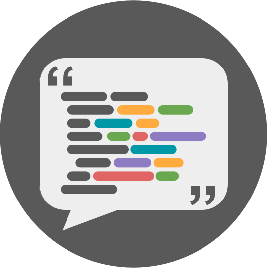

  
  <h1>The Software Citation Station</h1>
  
A website for making citing software used in your research quick and easy

  <a href="https://www.tomwagg.com/software-citation-station/">Visit the software citation station</a>
  • 
  <a href="https://www.tomwagg.com/software-citation-station/?new-software=true">Submit a new citation</a>
  • 
  <a href="https://github.com/TomWagg/software-citation-station/blob/main/paper.pdf">Read the paper</a>

<b>Why is it important to cite software?</b>

    Software is crucial for the advancement of astronomy and science especially in the context of rapidly growing datasets that increasingly require algorithm and pipeline development to process the data and produce results (<a class="ref-link" href="http://doi.org/10.17226/26141" target="_blank">Academies of Sciences, Engineering, and Medicine 2021</a>). However, software has not always been consistently cited, despite its importance to strengthen support for software
    development (<a class="ref-link" href="https://doi.org/10.1002/asi.23538" target="_blank">Howison & Bullard 2016</a>; <a class="ref-link" href="http://doi.org/10.48550/arXiv.1601.04734" target="_blank">Niemeyer et al. 2016</a>; <a class="ref-link" href="http://doi.org/https://doi.org/10.1016/j.joi.2017.08.003" target="_blank">Li et al. 2017</a>; <a class="ref-link" href="http://doi.org/10.3847/1538-4365/ab7be6" target="_blank">Bouquin et al. 2020</a>;
    <a class="ref-link" href="http://doi.org/https://doi.org/10.1016/j.joi.2021.101139" target="_blank">Alsudais 2021</a>; <a class="ref-link" href="http://doi.org/10.48550/arXiv.2302.07500" target="_blank">Bouquin et al. 2023</a>).

    To encourage, streamline, and standardize the process of citing software in academic work such as publications and presentations we introduce The Software Citation Station: a publicly available website and tool to quickly find or add software citations. You can read our paper about the importance of software (citations), resources for software citation, and a description of our tool at
    <a href="https://arxiv.org/abs/2406.04405">this link</a>.

